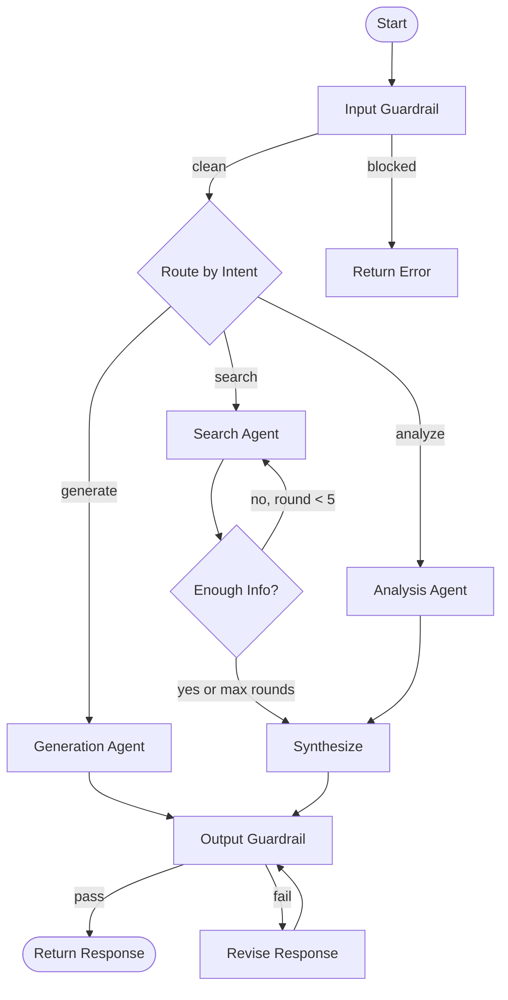

Design an AI agent system from requirements. Produces a complete architecture spec before any code is written.

## Process

### Phase 1: Requirements Gathering

Ask the user (conversationally, 3-5 questions):
- What should this agent DO? (input → output, concrete examples)
- What tools/APIs does it need access to?
- Who calls it? (user directly, another agent, API endpoint, cron job)
- What can go wrong? (bad input, API failures, hallucination, infinite loops)
- Performance requirements? (latency budget, cost budget per call)

### Phase 2: Pattern Selection

Based on requirements, recommend the best architecture pattern:

```
Single task, no branching          → Simple chain (LangChain LCEL)
Multiple task types                → Router pattern
Complex multi-step                 → Orchestrator-worker
Information gathering, variable    → Thinking loop (ReAct)
Quality-critical output            → Evaluator-optimizer loop
Untrusted input                    → Guardrailed pipeline
Multiple perspectives needed       → Parallel fan-out + merge
```

Research the pattern: use Context7 for LangGraph/PydanticAI docs, WebSearch for examples.

### Phase 3: Architecture Design

Produce a complete spec:

```markdown
# Agent Design: [Name]

## Overview
- **Purpose:** [one sentence]
- **Pattern:** [which architecture pattern]
- **Framework:** [LangGraph / PydanticAI / LangChain]
- **Input:** [what it receives]
- **Output:** [what it produces]

## State Graph



## State Schema
```python
class AgentState(BaseModel):
    """Typed state for the agent graph."""
    messages: list[BaseMessage] = []
    query: str = ""
    intent: str = ""  # classified by router
    context: list[RetrievedChunk] = []
    draft_response: str = ""
    confidence: float = 0.0
    iteration_count: int = 0
    max_iterations: int = 10  # hard stop
    tools_used: list[str] = []
    error: str | None = None
    guardrail_flags: list[str] = []
```

## Nodes

| Node | Purpose | Tools | Failure Mode |
|------|---------|-------|-------------|
| InputGuardrail | Sanitize input, detect injection | None | Block + return error |
| Router | Classify intent | LLM (Haiku — cheap) | Default to general |
| SearchAgent | Retrieve information | vector_search, web_search | Timeout → use cached |
| Evaluate | Decide if enough info | Sequential Thinking | Max iterations guard |
| Synthesize | Produce answer from context | LLM (Sonnet/GPT-4o) | Retry once |
| OutputGuardrail | Check grounding, PII, safety | Grounding checker | Revise loop (max 2) |

## Guardrails

### Input
- [ ] Prompt injection detection (regex + classifier)
- [ ] Input length limit (max 2000 tokens)
- [ ] Rate limiting (per user)

### Output
- [ ] Grounding check: all claims traceable to context
- [ ] PII detection: no personal data in response
- [ ] Hallucination flag: response makes claims not in any source
- [ ] Format validation: output matches expected schema

## Logging

Every agent run logs to `logs/agent_runs/{agent_name}/{timestamp}.json`:
```json
{
  "agent": "name",
  "query": "...",
  "trajectory": [
    {"node": "InputGuardrail", "duration_ms": 5, "result": "pass"},
    {"node": "Router", "duration_ms": 200, "result": "search"},
    {"node": "SearchAgent", "duration_ms": 1200, "tools": ["vector_search"], "chunks": 5},
    {"node": "Evaluate", "duration_ms": 150, "confidence": 0.85, "decision": "synthesize"},
    {"node": "Synthesize", "duration_ms": 2400, "tokens": 580},
    {"node": "OutputGuardrail", "duration_ms": 100, "grounding_score": 0.92}
  ],
  "total_ms": 4055,
  "total_tokens": 1240,
  "total_cost_usd": 0.018,
  "status": "success"
}
```

## Evaluation Criteria

| Metric | Target | How to Measure |
|--------|--------|---------------|
| Latency (p95) | <5s | Aggregate from logs |
| Grounding score | >0.8 | Output guardrail |
| Tool selection accuracy | >90% | Trajectory analysis |
| Error rate | <2% | Status field in logs |
| Cost per call | <$0.05 | Token tracking |

## Testing Strategy

1. **Happy path**: standard input → correct output
2. **Injection**: malicious input → guardrail blocks
3. **Tool failure**: search timeout → graceful degradation
4. **Loop termination**: never-satisfied → stops at max iterations
5. **Grounding**: response with invented claims → guardrail catches
6. **Edge cases**: empty input, very long input, non-English input

## Implementation Order

1. State schema + basic graph structure (no LLM calls, just flow)
2. Input guardrail (sanitization + validation)
3. Core logic nodes (one at a time, with tests)
4. Output guardrail (grounding check)
5. Logging (full trajectory)
6. Integration tests (end-to-end with mocked LLM)
7. Evaluation pipeline (metrics from logs)
```

### Phase 4: Review with User

Present the spec. Ask:
- "Does this architecture handle your use cases?"
- "Any edge cases I'm missing?"
- "Want me to adjust any node or add/remove guardrails?"

Iterate until approved. Save to `docs/agent-specs/[agent-name]-spec.md`.

### Rules
- ALWAYS include guardrails (input AND output) — no exceptions
- ALWAYS include max iteration count on loops
- ALWAYS include logging for every node transition
- ALWAYS define evaluation criteria with numeric targets
- Use Context7 for current LangGraph/PydanticAI API (not training data)
- Include Mermaid state graph diagram
- Include Pydantic state schema
- Include testing strategy
- Implementation order should be: structure → guardrails → logic → logging → tests

$ARGUMENTS
