# Claude Code Power Setup — Complete Guide

> A comprehensive walkthrough of every skill, hook, agent, and configuration in the Claude Code Power Setup. Includes architecture diagrams, real conversation examples, and step-by-step workflows.

---

## Table of Contents

- [Architecture Overview](#architecture-overview)
- [How the Three Levels Work Together](#how-the-three-levels-work-together)
- [The Planning Pipeline](#the-planning-pipeline)
- [The Development Pipeline](#the-development-pipeline)
- [Skills Reference](#skills-reference)
  - [Planning & Alignment](#1-planning--alignment)
  - [Architecture & Design](#2-architecture--design)
  - [Development Workflow](#3-development-workflow)
  - [Testing & Debugging](#4-testing--debugging)
  - [Code Review & Quality](#5-code-review--quality)
  - [Research & Productivity](#6-research--productivity)
  - [Experiments](#7-experiments)
  - [LLM Engineering](#8-llm-engineering)
- [Hook System Deep Dive](#hook-system-deep-dive)
- [Subagent System Deep Dive](#subagent-system-deep-dive)
- [MCP Servers](#mcp-servers)
- [Extension Guide](#extension-guide)

---

## Architecture Overview

The Power Setup is a configuration layer that sits on top of any Python/LLM project. It works at three levels:

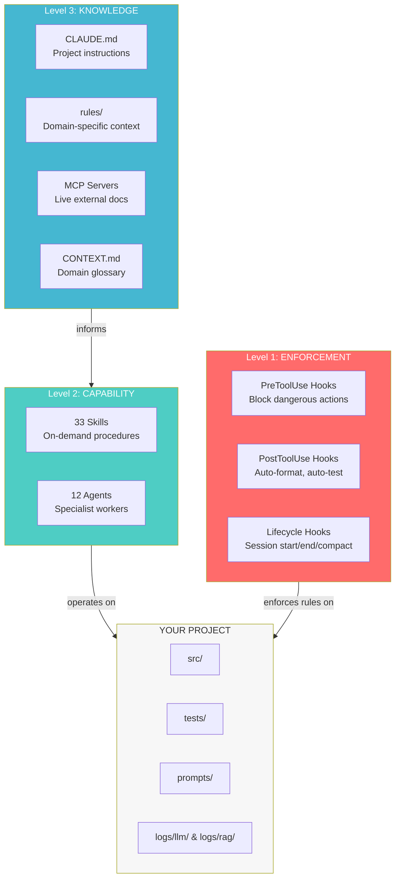

### What each level does

| Level | Mechanism | When it runs | Can Claude forget? | Token cost |
|-------|-----------|-------------|-------------------|------------|
| **Enforcement** | Hooks in settings.json | Automatically on every matching tool call | No — it's automatic | Zero |
| **Capability** | Skills + Agents | On demand (you invoke) or auto-dispatched | N/A — you trigger it | Per-invocation |
| **Knowledge** | CLAUDE.md + Rules + MCP | Always loaded or conditionally loaded | Yes — but cost is low | Varies |

---

## How the Three Levels Work Together

Here's what happens when you ask Claude to write a Python file:

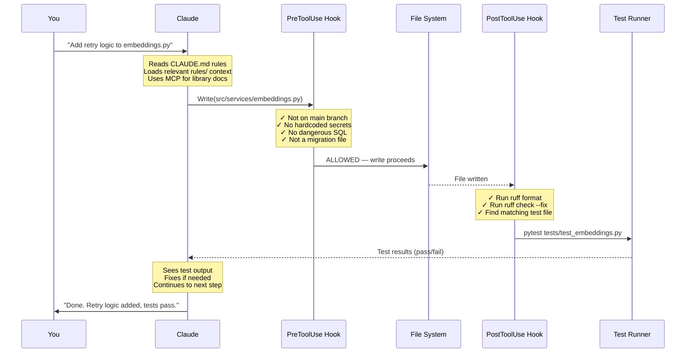

---

## The Planning Pipeline

For non-trivial features, use this pipeline to go from idea to implementation-ready tickets:

```mermaid
graph LR
    IDEA["Vague Idea"]
    BRAINSTORM["/brainstorm<br/>Research + approaches"]
    GRILL["/grill<br/>One question at a time"]
    GRILLDOCS["/grill-with-docs<br/>+ update CONTEXT.md"]
    PRD["/to-prd<br/>Structured spec"]
    ISSUES["/to-issues<br/>Vertical slice tickets"]
    BUILD["Ready to build"]

    IDEA --> BRAINSTORM
    BRAINSTORM --> GRILL
    GRILL --> PRD
    GRILLDOCS --> PRD
    PRD --> ISSUES
    ISSUES --> BUILD

    GRILL -.->|"if project has<br/>domain glossary"| GRILLDOCS

    style IDEA fill:#ffd93d,color:#333
    style BUILD fill:#6bcb77,color:#fff
    style BRAINSTORM fill:#4ecdc4,color:#fff
    style GRILL fill:#4ecdc4,color:#fff
    style GRILLDOCS fill:#4ecdc4,color:#fff
    style PRD fill:#4ecdc4,color:#fff
    style ISSUES fill:#4ecdc4,color:#fff
```

### Step 1: `/brainstorm` — Explore the space

**When:** You have a vague idea and want to understand what's possible.

**What it does:** Searches for prior art (web + GitHub), generates 3-5 approaches with architecture patterns, evaluates tradeoffs, and presents a decision matrix.

**Example conversation:**

```
You:     /brainstorm caching layer for our RAG pipeline

Claude:  Let me understand the problem first.
         
         Q: "What's the primary pain point — latency, cost, or both?
         My recommendation: Based on your logs/llm/ directory showing
         average embedding latency of 200ms and 40% duplicate queries,
         I'd say latency is the bigger win."

You:     Latency mainly, but cost savings would be nice too.

Claude:  [searches web for RAG caching patterns 2025]
         [searches GitHub for popular implementations]
         [checks Context7 for Redis + LangChain docs]
         
         ## Brainstorm: RAG Pipeline Caching
         
         ### Prior Art
         - LangChain has CacheBackedEmbeddings (built-in)
         - Zep project caches at the session level
         - GPTCache uses semantic similarity for cache hits
         
         ### Approaches
         
         | Approach | Architecture | Effort | Risk |
         |----------|-------------|--------|------|
         | A: Exact-match query cache | Redis lookup | Low | Low |
         | B: Semantic cache (GPTCache) | Embedding similarity | Medium | Medium |
         | C: Multi-layer (query + chunk + response) | Redis + LRU | Medium | Low |
         
         ### My Recommendation
         Start with A (exact-match). Your 40% duplicate rate means huge
         wins for minimal complexity. Add semantic later if needed.
```

### Step 2: `/grill` — Stress-test the plan

**When:** You've picked an approach and need to resolve all the design decisions.

**What it does:** Interviews you one question at a time. For each question, provides its recommended answer. Explores the codebase instead of asking when it can find the answer itself.

**Key mechanic:** One question at a time, with a recommended answer. Not an interrogation — a collaborative decision-making session.

```
You:     /grill I want to add exact-match query caching with Redis

Claude:  [explores src/rag/ to understand current flow]
         
         Q1: "Cache key strategy — raw query string, or normalized 
         (lowercased, whitespace-stripped, stop-words-removed)?
         
         My rec: Normalized. I see queries like 'What is X?' and 
         'what is x' in your logs that should be cache hits."

You:     Normalized, good call.

Claude:  Q2: "Cache invalidation — TTL-based, event-driven on 
         document re-ingestion, or manual flush?
         
         My rec: Event-driven. Your ingest.py already has a 
         post-ingestion hook point. TTL risks serving stale results."

You:     Event-driven, but also a TTL as a safety net — 24 hours.

Claude:  Q3: "What gets cached — just the chunk IDs, or the full 
         chunk content + metadata?
         
         My rec: Chunk IDs only. Content is already in your vector DB.
         Caching content duplicates storage and risks staleness."

         ... [continues until all decisions resolved]
```

### Step 3: `/grill-with-docs` — Grill + documentation as side effect

Same as `/grill`, but also updates your project docs during the conversation:

```
Claude:  I notice you said "cache" but your CONTEXT.md doesn't define what
         a cache means in your RAG context. Let me add it:
         
         [writes to CONTEXT.md]
         **Query Cache**: A Redis-backed mapping from normalized query strings
         to retrieved chunk IDs, invalidated on document re-ingestion.
         _Avoid_: result cache, embedding cache (those would be different things)

Claude:  This caching decision is hard to reverse (Redis dependency), surprising
         without context (why not just TTL?), and was a real trade-off.
         Want me to record it as an ADR?

You:     Yes.

Claude:  [writes docs/adr/0003-event-driven-cache-invalidation.md]
         "We chose event-driven invalidation over TTL for the query cache
         because 40% of queries repeat and stale results after doc updates
         would break user trust. Redis is already in the stack."
```

### Step 4: `/to-prd` — Synthesize into a spec

**Input:** A resolved conversation (run `/grill` first).
**Output:** `docs/specs/[feature]-prd.md`

| Section | Contents |
|---------|----------|
| Problem Statement | The user's pain, not the tech problem |
| Solution | High-level approach |
| User Stories | Extensive numbered list (As a... I want... so that...) |
| Implementation Decisions | Modules, schemas, APIs — no file paths (they go stale) |
| Testing Decisions | What gets tested, what makes a good test |
| Out of Scope | Explicit exclusions |

### Step 5: `/to-issues` — Spec → Vertical slice tickets

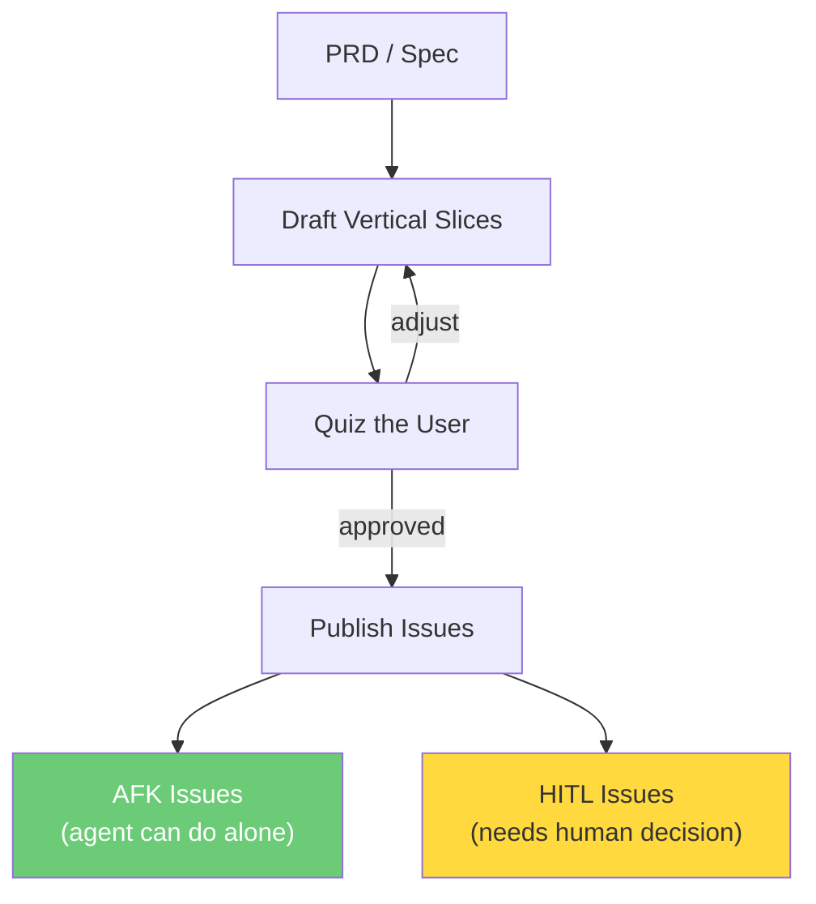

**Key concept:** Each issue cuts through ALL layers (schema + API + logic + tests). A completed issue is demoable on its own.

---

## The Development Pipeline

Once you have tickets, this is how each one gets built:

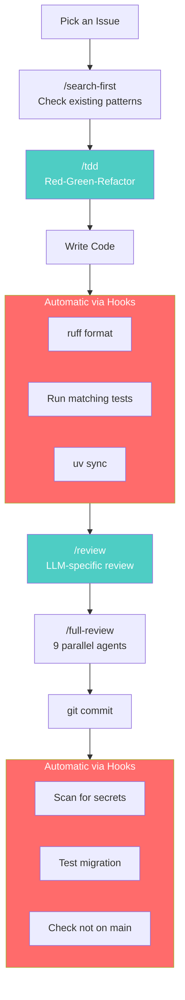

---

## Skills Reference

### 1. Planning & Alignment

| Skill | Purpose | Input | Output |
|-------|---------|-------|--------|
| `/grill` | Stress-test any plan | Your plan | Shared understanding |
| `/grill-with-docs` | Grill + update CONTEXT.md + ADRs | Your plan | Understanding + docs |
| `/to-prd` | Conversation → formal spec | Resolved conversation | `docs/specs/` PRD |
| `/to-issues` | Spec → vertical slice tickets | PRD | `docs/issues/` tickets |
| `/handoff` | Save context for next session | Current session | Handoff document |

---

### 2. Architecture & Design

| Skill | Purpose | Input | Output |
|-------|---------|-------|--------|
| `/design-agent` | Full agent architecture | Requirements | Spec with state graph |
| `/improve-architecture` | Find shallow modules to deepen | Codebase | Refactoring candidates |
| `/prototype` | Answer design questions fast | A question | Throwaway TUI or UI variants |
| `/zoom-out` | See the bigger picture | Current code location | Module map |

#### `/prototype` — Two branches

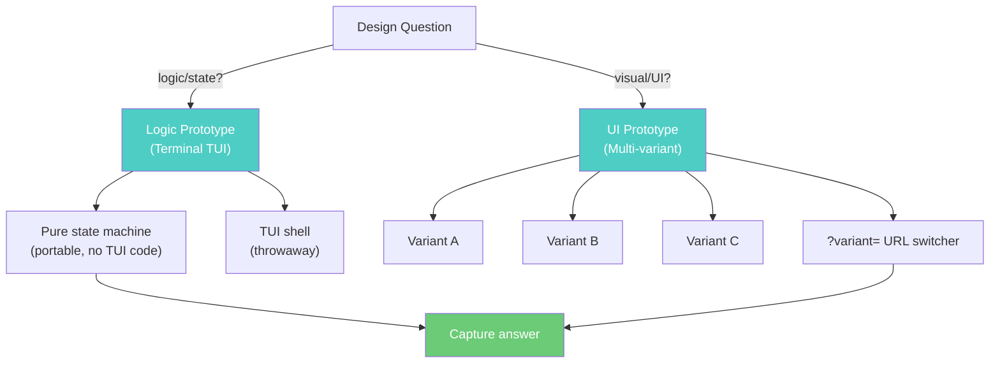

**Logic prototype example:**

```
┌─ Order State Machine ──────────────────────────────────┐
│ State: payment_failed                                   │
│ Items: [SKU-001 x2, SKU-042 x1]                       │
│ Reserved: True  ← BUG: items still reserved!           │
│ Payment: failed                                         │
│ Transitions: [r]etry payment  [c]ancel  [q]uit         │
└─────────────────────────────────────────────────────────┘
```

#### `/improve-architecture` — Parallel interface design

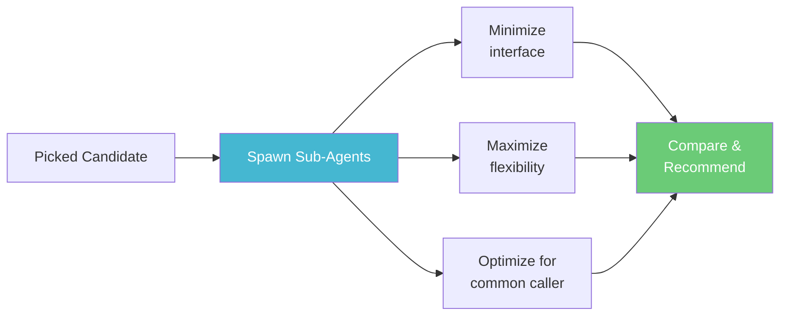

---

### 3. Development Workflow

| Skill | Purpose |
|-------|---------|
| `/brainstorm` | Research before building — prior art, approaches, decision matrix |
| `/brainstorm-panel` | Three models (Claude + Codex + Gemini) brainstorm in parallel |
| `/search-first` | Find existing patterns before writing new code |
| `/update-context` | Rewrite docs/context.md and docs/architecture.md |
| `/new-project` | Full project scaffold with Docker, logging, tests |

---

### 4. Testing & Debugging

#### `/tdd` — Vertical slice TDD


**WRONG:** Write all tests first → all implementation. **RIGHT:** One test → one implementation → repeat.

**Mocking rules:** Mock at system boundaries ONLY. NEVER mock your own classes.

#### `/diagnose` — Six-phase structured debugging

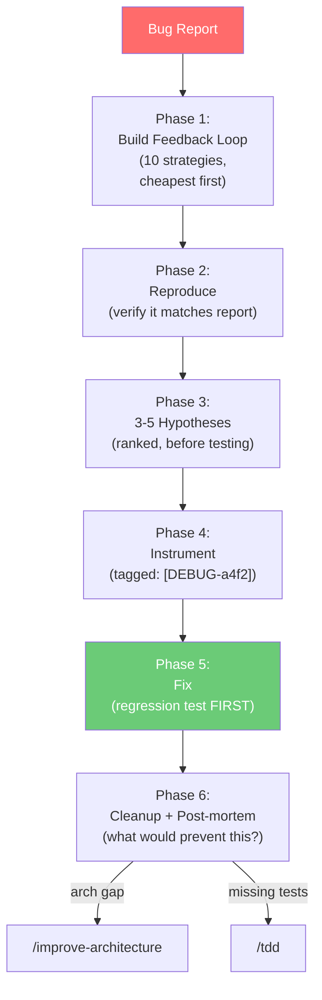

**Example:**

```
You:     /diagnose embedding service returns empty for queries > 200 chars

Claude:  Phase 1 — Feedback loop via failing test:
         
         test_long_query_returns_results()
         query = "a" * 201 + " machine learning"
         assert len(embed_and_search(query)) > 0  # FAILS ✓
         
         Phase 3 — Hypotheses:
         1. [HIGH] Token limit truncation at 512 tokens
         2. [MEDIUM] normalize_query() truncates input
         3. [LOW] Cosine similarity drops for long embeddings
         
         Testing #1: [DEBUG-e3f1] token count = 847, model max = 512
         Meaningful terms at positions 600-847 — past cutoff.
         
         Root cause confirmed. Writing regression test, then fix.
```

---

### 5. Code Review & Quality

#### `/review` — LLM-specific review

Catches: missing LLM logging, no token counting, temperature not set, unclosed async clients, inline prompts, no cost tracking.

#### `/full-review` — 9 parallel specialist agents

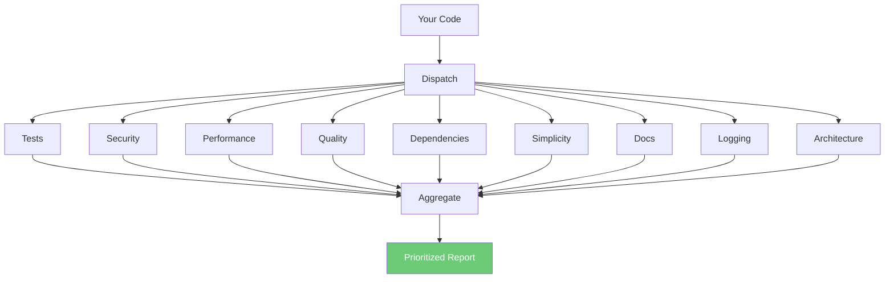

#### `/second-opinion` — Cross-model review

Sends diff to Codex CLI. Two models flagging the same issue = high confidence.

#### `/deploy-check` — Pre-deploy automation

Tests, lint, Docker build, health check, zombie scan, memory check.

---

### 6. Research & Productivity

| Skill | Purpose |
|-------|---------|
| `/deep-research` | Multi-round research loop with completeness evaluation |
| `/inspiration` | Analyze a GitHub repo → Keep / Adapt / Discard breakdown |
| `/self-learn` | Extract session knowledge into persistent rules |
| `/caveman` | ~75% token reduction, persists across session |
| `/autoloop` | Run any command on a recurring interval |
| `/offload` | Delegate long tasks to a background subagent |

#### `/caveman` — Before and after

```
Normal:  "Sure! I'd be happy to help you with that. The issue 
         you're experiencing is likely caused by a race condition 
         in the authentication middleware where the token validation
         check is not performed atomically..."

Caveman: "Race condition in auth middleware. Token check not atomic.
         Fix: wrap in transaction. Code:"
```

Auto-suspends for security warnings. Resumes after.

---

### 7. Experiments

| Skill | Purpose |
|-------|---------|
| `/new-experiment` | Fully isolated git worktree + uv env + logs |
| `/compare-experiments` | Side-by-side metrics comparison |
| `/cleanup-experiments` | Remove stale worktrees |
| `/freeze [path]` | Restrict Claude to one directory |
| `/unfreeze` | Remove restriction |

---

### 8. LLM Engineering

| Skill | Purpose |
|-------|---------|
| `/debug-llm` | Parse logs/llm/ for failures, cost, latency |
| `/cost-aware-pipeline` | Audit chain architecture for token waste |
| `/design-agent` | Full agent spec with state graph and guardrails |

---

## Hook System Deep Dive

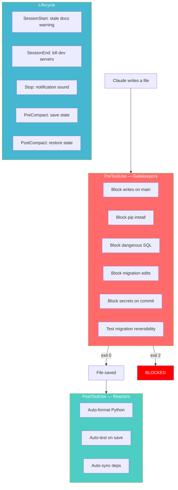

### How hooks receive data

The hook receives the tool call's input as JSON on stdin:

```json
{
  "file_path": "src/services/payment.py",
  "content": "import os\nSECRET_KEY = 'sk-abc123'..."
}
```

Exit codes: **0** = allow, **2** = BLOCK, **other** = allow with warning.

---

## Subagent System Deep Dive

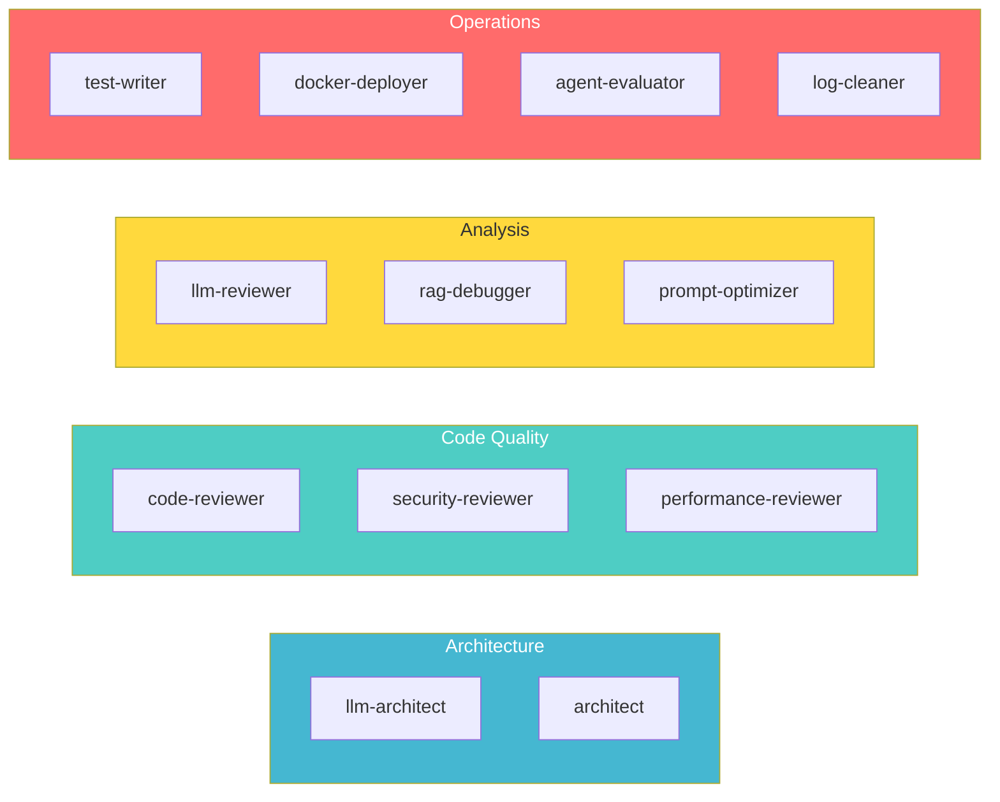

| Agent | Specialty | Example invocation |
|-------|-----------|-------------------|
| `llm-architect` | Model selection, serving, caching | "Evaluate our model routing strategy" |
| `architect` | LangGraph state graphs, agent patterns | "Design the state graph for our RAG agent" |
| `code-reviewer` | LLM-specific Python review | Auto-dispatched by `/full-review` |
| `security-reviewer` | Prompt injection, secrets, auth | "Audit the auth middleware" |
| `performance-reviewer` | N+1, async blocking, memory | "Find async blocking in the API layer" |
| `llm-reviewer` | Cost, latency, quality from logs | "Which prompts have the highest retry rate?" |
| `rag-debugger` | Chunks, scores, embeddings | "Why are similarity scores all near 0.5?" |
| `test-writer` | pytest with mocked LLM fixtures | "Write tests for the new search service" |
| `docker-deployer` | Images, compose, health checks | Auto-dispatched by `/deploy-check` |
| `prompt-optimizer` | Token efficiency, clarity | "Optimize the prompts/ directory" |
| `agent-evaluator` | Trajectory, guardrails, loops | "Stress-test the agent for infinite loops" |
| `log-cleaner` | Zombies, old logs, disk usage | "Clean up orphaned processes" |

---

## MCP Servers

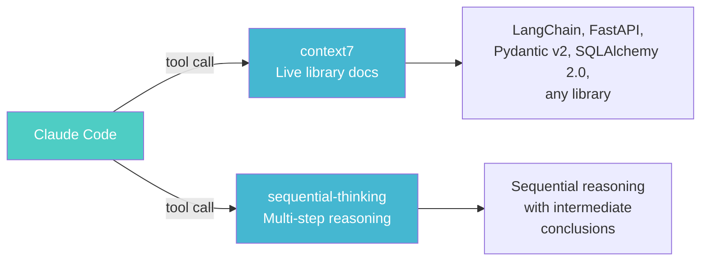

---

## Extension Guide

### Decision guide

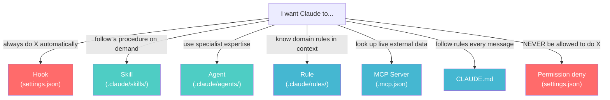

### Add a skill

```bash
mkdir -p .claude/skills/my-command
```

```markdown
# .claude/skills/my-command/SKILL.md
---
name: my-command
description: What this does
---

Instructions Claude follows when /my-command is invoked.
```

### Add an agent

```markdown
# .claude/agents/my-specialist.md
---
name: my-specialist
description: When to invoke this agent
tools: Read, Bash, Grep
---

You are an expert in X. When called, always...
```

### Add a hook

```json
{
  "hooks": {
    "PostToolUse": [{
      "matcher": "Write|Edit",
      "hooks": [{"type": "command", "command": "your-script.sh"}]
    }]
  }
}
```

---

*Generated for the [Claude Code Power Setup](https://github.com/arjunfzk/claude-code-custom-power-setup)*
