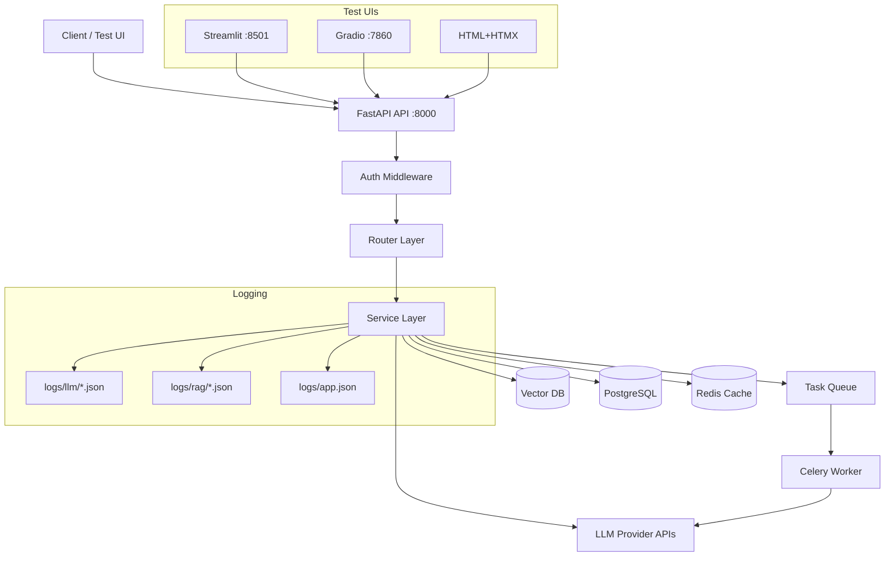
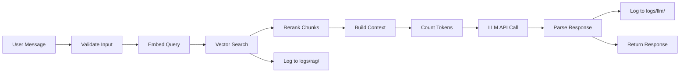
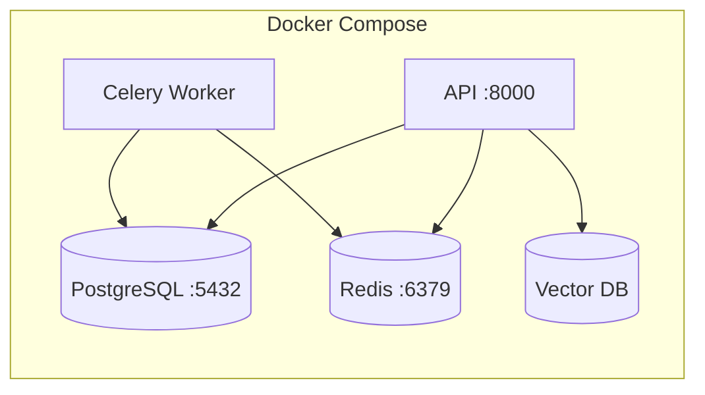

# Architecture

> Auto-generated by `/new-project`. Updated by `/update-context`.
> Last updated: [DATE]

## System Overview

## Data Flow: Chat Request

## Components

| Component | Location | Purpose |
|-----------|----------|---------|
| API Layer | `src/api/` | FastAPI routers, middleware, dependencies |
| LLM Chains | `src/chains/` | LangChain/LangGraph chains and workflows |
| AI Agents | `src/agents/` | PydanticAI agent definitions |
| RAG Pipeline | `src/rag/` | Chunking, embedding, search, reranking |
| Data Models | `src/models/` | Pydantic schemas (request, response, DB, LLM) |
| Services | `src/services/` | Business logic, orchestration, LLM logging |
| Database | `src/db/` | SQLAlchemy models, repositories, migrations |
| Workers | `src/workers/` | Celery/ARQ tasks for async LLM jobs |
| Config | `src/config/` | Pydantic Settings, environment config |
| Logging | `src/logging/` | loguru (console) + structlog (JSON) setup |
| Prompts | `prompts/` | Prompt templates (.txt, .jinja2) |
| Tests | `tests/` | pytest tests with mocked LLM fixtures |
| Test UIs | `ui/` | Streamlit, Gradio, HTML test interfaces |
| Docker | `docker/` | Dockerfile, docker-compose.yml |

## API Routes

| Method | Path | Handler | Description |
|--------|------|---------|-------------|
| GET | `/health` | `routes/health.py` | Check DB, Redis, LLM provider |
| POST | `/chat` | `routes/chat.py` | Synchronous chat |
| POST | `/chat/stream` | `routes/chat.py` | SSE streaming chat |
| POST | `/analyze` | `routes/analyze.py` | Document analysis |
| GET | `/jobs/{id}` | `routes/jobs.py` | Poll async job status |

## LLM Chains / Agents

| Name | Type | Location | Purpose |
|------|------|----------|---------|
| [To be filled as chains are created] | | | |

## Database Schema

| Table | Model | Purpose |
|-------|-------|---------|
| [To be filled as models are created] | | |

## Deployment

All services have health checks and memory limits. See `docker/docker-compose.yml`.
